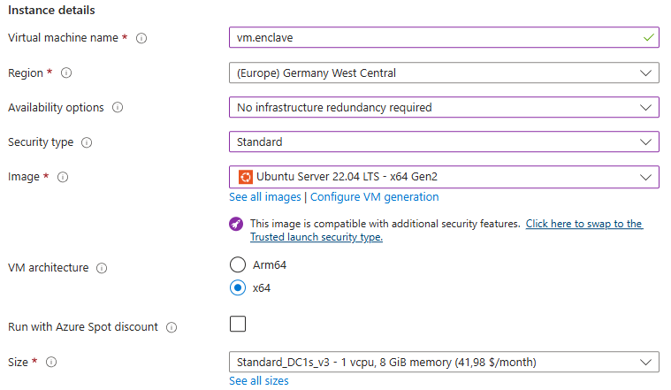

# ConfidentialWordCount

"Hello World"-Beispiel für Confidential Computing mit Azure DCsv2, .NET 8, C# (REST API), C++ (Enklave), Open Enclave SDK.

## Architektur

Client ⇄ REST API (.NET 8) ⇄ Enklave (C++/Open Enclave) ⇄ Word Count

## Projekte

- **ConfidentialWordCount.Api**: REST API (C#)
- **ConfidentialWordCount.Enclave**: Enklavenlogik (C++)
- **ConfidentialWordCount.Enclave.Common**: Gemeinsame Header/Interfaces

## Deployment

- Siehe Ordner `Deployment` für Skripte und GitHub Actions.


## Create a VM for testing the application

### In Azure Portal, create the following VM:
- Availability options: No infrastructure redundancy required
- Security type: Standard
- OS: Ubuntu Server 22.04 LTS Gen. 2
- Standard DC1s v3 (1 vcpu, 8 GiB memory) 



### Connect to VM using SSH:

```powershell
ssh <username>@<ip address>
```

### Install .Net:

Add Microsoft package signing key and feed:

```powershell
# 1. Add Microsoft package repository
wget https://packages.microsoft.com/config/ubuntu/22.04/packages-microsoft-prod.deb -O packages-microsoft-prod.deb
sudo dpkg -i packages-microsoft-prod.deb

# 2. Update apt package lists
sudo apt update

# 3. Install the .NET 8 SDK
sudo apt install -y dotnet-sdk-8.0

# 4. Verify the installation
dotnet --version
```
must result in
```powershell
8.0.411
```

### Install Intel's SGX Repository

```powershell
# Download and install Intel’s SGX repository keys and sources
wget https://download.01.org/intel-sgx/sgx_repo/ubuntu/intel-sgx-deb.key
sudo apt-key add intel-sgx-deb.key

sudo bash -c 'echo "deb [arch=amd64] https://download.01.org/intel-sgx/sgx_repo/ubuntu focal main" > /etc/apt/sources.list.d/intel-sgx.list'
```

### Install Open Enclave

```powershell
# 1. Add Microsoft's GPG key and repository
wget https://packages.microsoft.com/config/ubuntu/20.04/packages-microsoft-prod.deb -O packages-microsoft-prod.deb
sudo dpkg -i packages-microsoft-prod.deb

# 2. Update package lists
sudo apt update

# 3. Install Open Enclave SDK and related tools
sudo apt install -y \
    open-enclave \
    open-enclave-hostverify \
    az-dcap-client \
    libssl-dev \
    gdb \
    clang \
    llvm-11

```


## Lizenz

Siehe [LICENSE](LICENSE).
